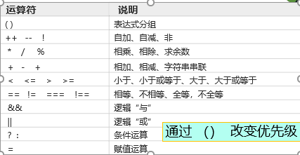

### 淘宝中涉及那些动态效果，交互效果
* 1、注册表单验证
* 2、弹出登录框
* 3、商品图片的放大效果
* 4、缩略图的切换
* 5、回到顶部的效果 

### 运算符
* 算术： + - * / % ++ --
* 赋值 = += -= *= %=
* 字符串的拼接 +
* 比较 == === != > < <= >=
* 逻辑 

#### 
* "=="判断值是否相等
* "==="先判断变量类型在判断变量的值

### 数据类型转换
#### 隐式转换
* 转换成String类型；用+连接
#### 显示（强制转换）
* 数值转换为布尔类型
- 0 ,0.0,0->false
- NaN ->false
- 其他数值，比如1、2、-5、->true
* undefined 转换为布尔类型 ->false
* null->false
* ""->false
* "非空的"->false

#### 运算符左右类型转换规则
* + 左右出现字符串时，作为字符运算符使用
* 算术运算符-+*/%都会自动的将字符串（布尔）自动的转换成数字
* 比较运算符，两侧的字符串（布尔）会自动的转换为数值类型

#### javascript流程控制
##### 程序流程控制
* 程序=数据+算法
* 任何复杂的算法都可以通过“顺序”，“分支”，“循环”

* 分支语句
