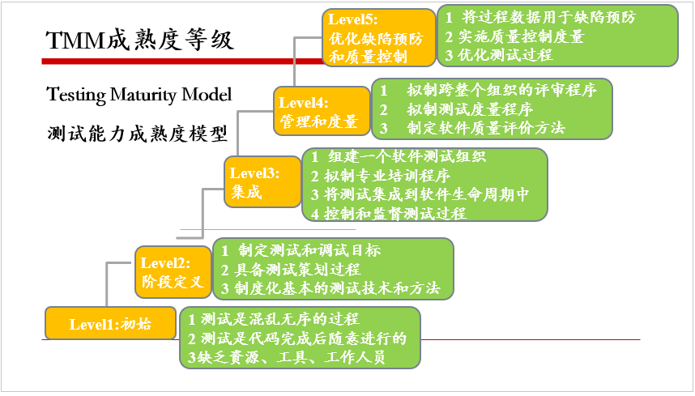

### 软件测试的发展历程
#### 初始阶段
* 20世纪70年代以前
* 测试等同于“调试”
* 1957年测试与“调试”区别开
* 无法适应软件行业发展的需求
#### 定义阶段
* 软件工程开始受到广泛关注，人们对软件测试方法和过程开探索
* Bill Hetzel~软件测试的目的是验证软件时工作的
* 软件测试的目的是伪证~找BUG的，以逆向思维推测
#### 集成阶段
* 软件开发方式逐渐由混乱无序的开发过程过渡到结构化的开发过程
* 出现软件测试行业的标准（IEEE/ANSI）和ISO国际标准
* 1981年，Bill Hetzel首次在大学开设Structured Software Testing 公共课，成为IT技术人员需要掌握的核心技术
#### 管理、测试和最佳化阶段
* 20世纪90年代，软件测试进入全面发展时期
* 出现多种测试工具
* Gelper博士提出测试支持模型

### 软件测试现状
#### 软件测试现状：国外现状
* 相当成熟，并已经成为一个独立的产业
** 软件测试在公司中的地位非常重要
** 软件测试的理论研究蓬勃发展
** 软件测试市场繁荣
#### 软件测试现状：国内现状
* 萌芽中市场正在起步
** 对软件测试的认识和重视程度不断提高
** 对软件产品化测试的技术研究从手动向自动化方向不断发展

##### 外包测试现状
##### 三种模式
* 现场测试模式
* 内部测试模式
** 完全离岸外包模式
** 现场增援与离岸结合模式
* 设立联合研发中心模式

##### 软件测试职业的意义
* 初级软件测试工程师
* 测试开发工程师
* 测试团队管理（测试总监）
* .......

##### 软件测试人员具备的素质
* 对软件测试工作有正确的认识
* 具有很强的沟通能力、外交能力
* 掌握较多能力

##### 软件测试过程模型
* V模型
用户需求《------------测试与开发严格对应--------------》验收测试
    需求分析《---------------------------》确认与系统测试
        概要设计《---------------------》集成测试
            详细设计《------------》单元测试
                    编码
* V模型局限性
** 测试滞后
** 缺少静态测试

* W模型特征
** 静态测试和动态测试行为伴随需求分析、设计和编码等一系列串行的活动
** 开发、测试之间保持着线性的前后关系，无法支持第代的开发模型，无法支持变更调整
** 无法体现出测试的流程来

* H模型
** 测试流程应独立于其他流程，且应该保持自身的完整性

* X模型
** 清晰地体现了单元测试